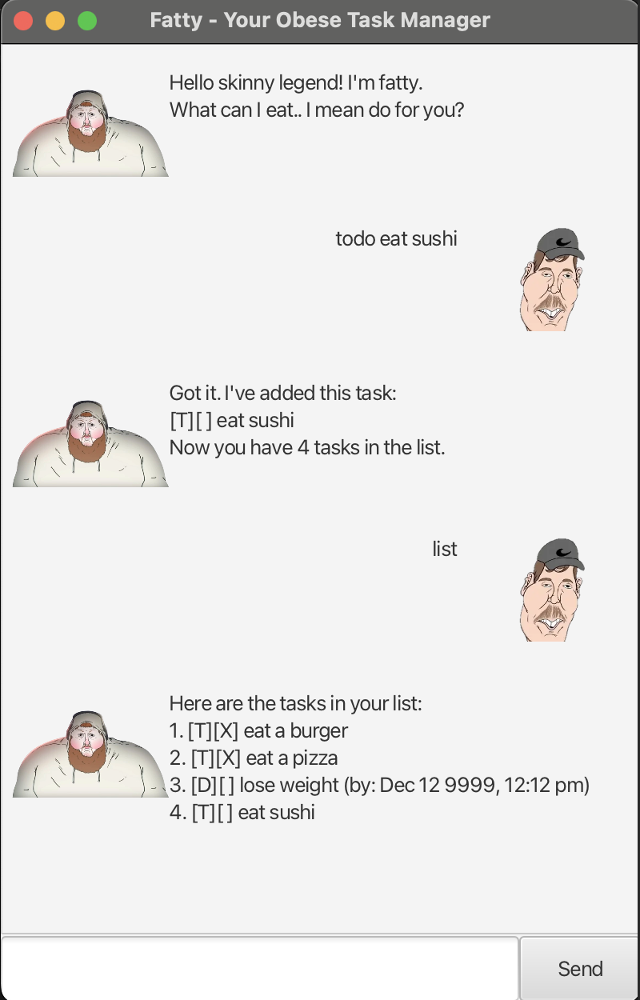

# Fatty User Guide

Fatty is your personal obese task manager!
He is a round and soft personal assistant that can help make sure you are on top of your tasks!
#  Adding Tasks

There are 3 main types of tasks.

### ToDo Tasks `todo`
This is the most basic form of task which only has a description.

Format: `todo (task description)`

Example: `todo eat`
### Deadline Tasks `deadline`
This is a task which contains both a description and a deadline!

Format: `deadline (task description) \by (dd/mm/yy hhmm)`

Example: `deadline cook /by 12/12/2025 1200`

### Event Tasks `event`
This is a task which contains a description, a start and an end time.

Format: `event (task description) \from (dd/mm/yy HHmm) \to (dd/mm/yy HHmm)`

Example: `event buffet /from 12/12/2025 1200 /to 12/12/2025 1500`

## Delete Task `delete`
Remove tasks from your task list.

Format: `delete (INDEX)`

Example: `delete 1` to delete task number 1 on the list.

## View List `list`

`list` to view full task list.

Format: `list`

## Mark/Unmark Tasks `mark`,`unmark`
Mark or unmark tasks as completed.

Format: `mark (INDEX)` or `unmark (INDEX)`

Example: `mark 1` to mark task number 1 on the list.

## Find Tasks `find`
You can find tasks on the list with a `keyword`.

Format: `find (keyword)`

Example: `find eat` to show a tasklist with all tasks with eat in the task description.

## Exit `bye`
To end the conversation with fatty and close the gui.

Fatty will create a file for first-time users to save the task list for future use.

Format: `bye`